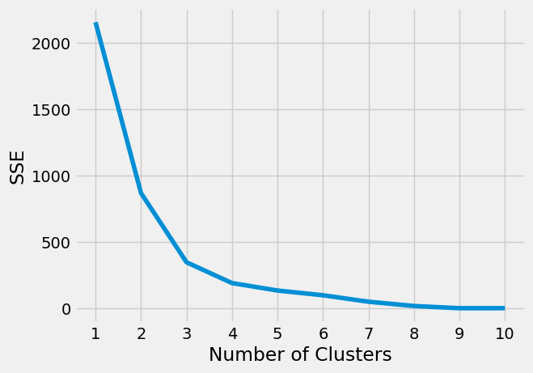
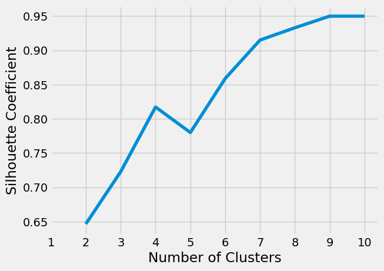

# Laboratorio 4 - Familias de Malware
## Sebastián Maldonado


```python
import pandas as pd
import numpy as np
import matplotlib.pyplot as plt
from sklearn.cluster import KMeans
from sklearn.feature_extraction.text import CountVectorizer
from sklearn.metrics import silhouette_score
import warnings
warnings.filterwarnings('ignore')
```

## Parte 1
### Creación del dataset
Para la creación del dataset se analizaron las muestras de malware en una máquina virtual con kali linux. En esta máquina virtual se descomprimió el archivo MALWR.zip y se desempaquetaron los ejecutables con upx. Luego se creó un programa en python para convertir las llamadas al API de los malwares a un csv. Este programa se llama `peheaders.py` y es una adaptación del programa proporcionado en la plataforma. Para introducir los datos de cada malware se ejecutó el siguiente comando en bash (los malwares estan en una carpeta llamada MALWR):

```bash
for filename in MALWR/*
do
python3 peheaders.py $filename
done
```
En el lugar que se ejecuta este comando se guarda un archivo llamado `dataset.csv` el cual es usado en el resto del laboratorio.

### Exploración y pre-procesamiento de datos


```python
df = pd.read_csv("dataset.csv")
df.head(10)
```


<div>
<style scoped>
    .dataframe tbody tr th:only-of-type {
        vertical-align: middle;
    }

    .dataframe tbody tr th {
        vertical-align: top;
    }

    .dataframe thead th {
        text-align: right;
    }
</style>
<table border="1" class="dataframe">
  <thead>
    <tr style="text-align: right;">
      <th></th>
      <th>file</th>
      <th>api</th>
    </tr>
  </thead>
  <tbody>
    <tr>
      <th>0</th>
      <td>1F2EB7B090018D975E6D9B40868C94CA</td>
      <td>CloseHandle,WaitForSingleObject,CreateEventA,E...</td>
    </tr>
    <tr>
      <th>1</th>
      <td>6FAA4740F99408D4D2DDDD0B09BBDEFD</td>
      <td>CloseHandle,WaitForSingleObject,CreateEventA,E...</td>
    </tr>
    <tr>
      <th>2</th>
      <td>33DE5067A433A6EC5C328067DC18EC37</td>
      <td>CloseHandle,WaitForSingleObject,CreateEventA,E...</td>
    </tr>
    <tr>
      <th>3</th>
      <td>99A39866A657A10949FCB6D634BB30D5</td>
      <td>CloseHandle,WaitForSingleObject,CreateEventA,E...</td>
    </tr>
    <tr>
      <th>4</th>
      <td>650A6FCA433EE243391E4B4C11F09438</td>
      <td>CloseHandle,WaitForSingleObject,CreateEventA,E...</td>
    </tr>
    <tr>
      <th>5</th>
      <td>8442AE37B91F279A9F06DE4C60B286A3</td>
      <td>CloseHandle,WaitForSingleObject,CreateEventA,E...</td>
    </tr>
    <tr>
      <th>6</th>
      <td>65018CD542145A3792BA09985734C12A</td>
      <td>CloseHandle,WaitForSingleObject,CreateEventA,E...</td>
    </tr>
    <tr>
      <th>7</th>
      <td>785003A405BC7A4EBCBB21DDB757BF3F</td>
      <td>CloseHandle,WaitForSingleObject,CreateEventA,E...</td>
    </tr>
    <tr>
      <th>8</th>
      <td>A316D5AECA269CA865077E7FFF356E7D</td>
      <td>CloseHandle,WaitForSingleObject,CreateEventA,E...</td>
    </tr>
    <tr>
      <th>9</th>
      <td>AAAz2E1B6940985A23E5639450F8391820655</td>
      <td>GetVersionExA,FreeLibrary,GetWindowsDirectoryA...</td>
    </tr>
  </tbody>
</table>
</div>


```python
names = df["file"]
df = df.drop("file", axis=1)
body = np.array(df['api'])
```


```python
cv = CountVectorizer()
cv_matrix = cv.fit_transform(body)
cv_matrix = cv_matrix.toarray()
vocabulario = cv.get_feature_names_out()
vocabulario.shape
bow = pd.DataFrame(cv_matrix, columns=vocabulario)
bow.head(10)
```


<div>
<style scoped>
    .dataframe tbody tr th:only-of-type {
        vertical-align: middle;
    }

    .dataframe tbody tr th {
        vertical-align: top;
    }

    .dataframe thead th {
        text-align: right;
    }
</style>
<table border="1" class="dataframe">
  <thead>
    <tr style="text-align: right;">
      <th></th>
      <th>1type_info</th>
      <th>__cxxframehandler</th>
      <th>__dllonexit</th>
      <th>__getmainargs</th>
      <th>__p___initenv</th>
      <th>__p__commode</th>
      <th>__p__fmode</th>
      <th>__set_app_type</th>
      <th>__setusermatherr</th>
      <th>_acmdln</th>
      <th>...</th>
      <th>wcstombs</th>
      <th>writefile</th>
      <th>wsacleanup</th>
      <th>wsagetlasterror</th>
      <th>wsasetlasterror</th>
      <th>wsastartup</th>
      <th>wsprintfa</th>
      <th>xz</th>
      <th>yapaxi</th>
      <th>yaxpax</th>
    </tr>
  </thead>
  <tbody>
    <tr>
      <th>0</th>
      <td>0</td>
      <td>0</td>
      <td>0</td>
      <td>1</td>
      <td>0</td>
      <td>1</td>
      <td>1</td>
      <td>1</td>
      <td>1</td>
      <td>1</td>
      <td>...</td>
      <td>0</td>
      <td>1</td>
      <td>0</td>
      <td>0</td>
      <td>0</td>
      <td>1</td>
      <td>0</td>
      <td>0</td>
      <td>0</td>
      <td>0</td>
    </tr>
    <tr>
      <th>1</th>
      <td>0</td>
      <td>0</td>
      <td>0</td>
      <td>1</td>
      <td>0</td>
      <td>1</td>
      <td>1</td>
      <td>1</td>
      <td>1</td>
      <td>1</td>
      <td>...</td>
      <td>0</td>
      <td>1</td>
      <td>0</td>
      <td>0</td>
      <td>0</td>
      <td>1</td>
      <td>0</td>
      <td>0</td>
      <td>0</td>
      <td>0</td>
    </tr>
    <tr>
      <th>2</th>
      <td>0</td>
      <td>0</td>
      <td>0</td>
      <td>1</td>
      <td>0</td>
      <td>1</td>
      <td>1</td>
      <td>1</td>
      <td>1</td>
      <td>1</td>
      <td>...</td>
      <td>0</td>
      <td>1</td>
      <td>0</td>
      <td>0</td>
      <td>0</td>
      <td>1</td>
      <td>0</td>
      <td>0</td>
      <td>0</td>
      <td>0</td>
    </tr>
    <tr>
      <th>3</th>
      <td>0</td>
      <td>0</td>
      <td>0</td>
      <td>1</td>
      <td>0</td>
      <td>1</td>
      <td>1</td>
      <td>1</td>
      <td>1</td>
      <td>1</td>
      <td>...</td>
      <td>0</td>
      <td>1</td>
      <td>0</td>
      <td>0</td>
      <td>0</td>
      <td>1</td>
      <td>0</td>
      <td>0</td>
      <td>0</td>
      <td>0</td>
    </tr>
    <tr>
      <th>4</th>
      <td>0</td>
      <td>0</td>
      <td>0</td>
      <td>1</td>
      <td>0</td>
      <td>1</td>
      <td>1</td>
      <td>1</td>
      <td>1</td>
      <td>1</td>
      <td>...</td>
      <td>0</td>
      <td>1</td>
      <td>0</td>
      <td>0</td>
      <td>0</td>
      <td>1</td>
      <td>0</td>
      <td>0</td>
      <td>0</td>
      <td>0</td>
    </tr>
    <tr>
      <th>5</th>
      <td>0</td>
      <td>0</td>
      <td>0</td>
      <td>1</td>
      <td>0</td>
      <td>1</td>
      <td>1</td>
      <td>1</td>
      <td>1</td>
      <td>1</td>
      <td>...</td>
      <td>0</td>
      <td>1</td>
      <td>0</td>
      <td>0</td>
      <td>0</td>
      <td>1</td>
      <td>0</td>
      <td>0</td>
      <td>0</td>
      <td>0</td>
    </tr>
    <tr>
      <th>6</th>
      <td>0</td>
      <td>0</td>
      <td>0</td>
      <td>1</td>
      <td>0</td>
      <td>1</td>
      <td>1</td>
      <td>1</td>
      <td>1</td>
      <td>1</td>
      <td>...</td>
      <td>0</td>
      <td>1</td>
      <td>0</td>
      <td>0</td>
      <td>0</td>
      <td>1</td>
      <td>0</td>
      <td>0</td>
      <td>0</td>
      <td>0</td>
    </tr>
    <tr>
      <th>7</th>
      <td>0</td>
      <td>0</td>
      <td>0</td>
      <td>1</td>
      <td>0</td>
      <td>1</td>
      <td>1</td>
      <td>1</td>
      <td>1</td>
      <td>1</td>
      <td>...</td>
      <td>0</td>
      <td>1</td>
      <td>0</td>
      <td>0</td>
      <td>0</td>
      <td>1</td>
      <td>0</td>
      <td>0</td>
      <td>0</td>
      <td>0</td>
    </tr>
    <tr>
      <th>8</th>
      <td>0</td>
      <td>0</td>
      <td>0</td>
      <td>1</td>
      <td>0</td>
      <td>1</td>
      <td>1</td>
      <td>1</td>
      <td>1</td>
      <td>1</td>
      <td>...</td>
      <td>0</td>
      <td>1</td>
      <td>0</td>
      <td>0</td>
      <td>0</td>
      <td>1</td>
      <td>0</td>
      <td>0</td>
      <td>0</td>
      <td>0</td>
    </tr>
    <tr>
      <th>9</th>
      <td>1</td>
      <td>1</td>
      <td>0</td>
      <td>0</td>
      <td>0</td>
      <td>0</td>
      <td>0</td>
      <td>0</td>
      <td>0</td>
      <td>0</td>
      <td>...</td>
      <td>1</td>
      <td>1</td>
      <td>1</td>
      <td>1</td>
      <td>1</td>
      <td>1</td>
      <td>1</td>
      <td>1</td>
      <td>0</td>
      <td>1</td>
    </tr>
  </tbody>
</table>
<p>10 rows × 348 columns</p>
</div>


## Parte 2
### Implementación del modelo
- #### Método del codo


```python
kmeans_kwargs = {"init": "random", "max_iter": 1000, "random_state": 121}
```


```python
sse = []

for k in range(1,11):
    model = KMeans(n_clusters=k, **kmeans_kwargs)
    model.fit(bow)
    sse.append(model.inertia_)
```


```python
plt.style.use("fivethirtyeight")
plt.plot(range(1, 11), sse)
plt.xticks(range(1, 11))
plt.xlabel("Number of Clusters")
plt.ylabel("SSE")
plt.show()
```


    

    


- #### Método de Silhouette


```python
sil_coefficients = []

for k in range(2, 11):
    model = KMeans(n_clusters=k, **kmeans_kwargs)
    model.fit(bow)
    score = silhouette_score(bow, model.labels_)
    sil_coefficients.append(score)
```


```python
plt.style.use("fivethirtyeight")
plt.plot(range(2, 11), sil_coefficients)
plt.xticks(range(1, 11))
plt.xlabel("Number of Clusters")
plt.ylabel("Silhouette Coefficient")
plt.show()
```


    

    


#### Kmeans para k=4


```python
model = KMeans(n_clusters=4, ** kmeans_kwargs)
model.fit(bow)
result_df = pd.DataFrame()
result_df['File'] = names
result_df['Cluster'] = model.labels_
result_df
```


<div>
<style scoped>
    .dataframe tbody tr th:only-of-type {
        vertical-align: middle;
    }

    .dataframe tbody tr th {
        vertical-align: top;
    }

    .dataframe thead th {
        text-align: right;
    }
</style>
<table border="1" class="dataframe">
  <thead>
    <tr style="text-align: right;">
      <th></th>
      <th>File</th>
      <th>Cluster</th>
    </tr>
  </thead>
  <tbody>
    <tr>
      <th>0</th>
      <td>1F2EB7B090018D975E6D9B40868C94CA</td>
      <td>0</td>
    </tr>
    <tr>
      <th>1</th>
      <td>6FAA4740F99408D4D2DDDD0B09BBDEFD</td>
      <td>0</td>
    </tr>
    <tr>
      <th>2</th>
      <td>33DE5067A433A6EC5C328067DC18EC37</td>
      <td>0</td>
    </tr>
    <tr>
      <th>3</th>
      <td>99A39866A657A10949FCB6D634BB30D5</td>
      <td>0</td>
    </tr>
    <tr>
      <th>4</th>
      <td>650A6FCA433EE243391E4B4C11F09438</td>
      <td>0</td>
    </tr>
    <tr>
      <th>5</th>
      <td>8442AE37B91F279A9F06DE4C60B286A3</td>
      <td>0</td>
    </tr>
    <tr>
      <th>6</th>
      <td>65018CD542145A3792BA09985734C12A</td>
      <td>0</td>
    </tr>
    <tr>
      <th>7</th>
      <td>785003A405BC7A4EBCBB21DDB757BF3F</td>
      <td>0</td>
    </tr>
    <tr>
      <th>8</th>
      <td>A316D5AECA269CA865077E7FFF356E7D</td>
      <td>0</td>
    </tr>
    <tr>
      <th>9</th>
      <td>AAAz2E1B6940985A23E5639450F8391820655</td>
      <td>2</td>
    </tr>
    <tr>
      <th>10</th>
      <td>AL65_DB05DF0498B59B42A8E493CF3C10C578</td>
      <td>2</td>
    </tr>
    <tr>
      <th>11</th>
      <td>B98hX8E8622C393D7E832D39E620EAD5D3B49</td>
      <td>2</td>
    </tr>
    <tr>
      <th>12</th>
      <td>B07322743778B5868475DBE66EEDAC4F</td>
      <td>0</td>
    </tr>
    <tr>
      <th>13</th>
      <td>BVJ2D9FBF759F527AF373E34673DC3ACA462</td>
      <td>0</td>
    </tr>
    <tr>
      <th>14</th>
      <td>DS22_A670D13D4D014169C4080328B8FEB86</td>
      <td>3</td>
    </tr>
    <tr>
      <th>15</th>
      <td>EEE99EC8AA67B05407C01094184C33D2B5A44</td>
      <td>0</td>
    </tr>
    <tr>
      <th>16</th>
      <td>F6655E39465C2FF5B016980D918EA028</td>
      <td>0</td>
    </tr>
    <tr>
      <th>17</th>
      <td>F8437E44748D2C3FCF84019766F4E6DC</td>
      <td>0</td>
    </tr>
    <tr>
      <th>18</th>
      <td>FGJKJJ1_2BA0D0083976A5C1E3315413CDCFFCD2</td>
      <td>0</td>
    </tr>
    <tr>
      <th>19</th>
      <td>FGTR43_EF8E0FB20E7228C7492CCDC59D87C690</td>
      <td>2</td>
    </tr>
    <tr>
      <th>20</th>
      <td>FHHH6576C196385407B0F7F4B1B537D88983</td>
      <td>0</td>
    </tr>
    <tr>
      <th>21</th>
      <td>FTTR9EA3C16194CE354C244C1B74C46CD92E</td>
      <td>0</td>
    </tr>
    <tr>
      <th>22</th>
      <td>GBV66_8F259BB36E00D124963CFA9B86F502E</td>
      <td>3</td>
    </tr>
    <tr>
      <th>23</th>
      <td>GFT4_7DDD3D72EAD03C7518F5D47650C8572</td>
      <td>3</td>
    </tr>
    <tr>
      <th>24</th>
      <td>HJGQDD892986B2249B5214639ECC8AC0223</td>
      <td>0</td>
    </tr>
    <tr>
      <th>25</th>
      <td>JH78C0A33A1B472A8C16123FD696A5CE5EBB</td>
      <td>0</td>
    </tr>
    <tr>
      <th>26</th>
      <td>JKK8CA6FE7A1315AF5AFEAC2961460A80569</td>
      <td>0</td>
    </tr>
    <tr>
      <th>27</th>
      <td>K99_C3A9A7B026BFE0E55FF219FD6AA7D94</td>
      <td>3</td>
    </tr>
    <tr>
      <th>28</th>
      <td>KLp90_6D5C8FC4B14559F73B6136D85B94198</td>
      <td>3</td>
    </tr>
    <tr>
      <th>29</th>
      <td>L11_1415EB8519D13328091CC5C76A624E3D</td>
      <td>1</td>
    </tr>
    <tr>
      <th>30</th>
      <td>NBV_8B75BCBFF174C25A0161F30758509A44</td>
      <td>0</td>
    </tr>
    <tr>
      <th>31</th>
      <td>NV99_C9C9DBF388A8D81D8CFB4D3FC05F8E4</td>
      <td>3</td>
    </tr>
    <tr>
      <th>32</th>
      <td>PL98_BD8B082B7711BC980252F988BB0CA936</td>
      <td>2</td>
    </tr>
    <tr>
      <th>33</th>
      <td>POL55_A4F1ECC4D25B33395196B5D51A06790</td>
      <td>3</td>
    </tr>
    <tr>
      <th>34</th>
      <td>QW2_4C6BDDCCA2695D6202DF38708E14FC7E</td>
      <td>2</td>
    </tr>
    <tr>
      <th>35</th>
      <td>RTC_7F85D7F628CE62D1D8F7B39D8940472</td>
      <td>1</td>
    </tr>
    <tr>
      <th>36</th>
      <td>SAM_B659D71AE168E774FAAF38DB30F4A84</td>
      <td>3</td>
    </tr>
    <tr>
      <th>37</th>
      <td>TG78Z__727A6800991EEAD454E53E8AF164A99C</td>
      <td>2</td>
    </tr>
    <tr>
      <th>38</th>
      <td>VBMM9_149B7BD7218AAB4E257D28469FDDB0D</td>
      <td>1</td>
    </tr>
    <tr>
      <th>39</th>
      <td>VC990_468FF2C12CFFC7E5B2FE0EE6BB3B239E</td>
      <td>2</td>
    </tr>
  </tbody>
</table>
</div>


### Conclusiones

1. __¿Para qué número de clústeres se obtiene el coeficiente de Silhouette más alto?__  
Para 9 clústeres se obtiene el coeficiente de Silhouette más alto.
2. __¿Coincide el coeficiente de Silhouette con el método del codo?__  
Pareciera que no coinciden los dos métodos ya que en el método del codo se mira como que el número óptimo de clusteres es 4 porque parece el codo de la gráfica y en el método de Silhouette el número máximo está en el 9. Algo que podemos notar es que en la gráfica de Silhouette vemos que el índice crece constantemente hasta el 4 (coincide con el método del codo), luego baja con 5 clusteres y continúa subiendo del 6-9.  
Podríamos tomar este resultado para concluir que el número óptimo de clusteres es 4 comparando los resultados de los dos métodos
3. __¿Cuántas familias existen entre los ejemplares de malware proporcionados?__  
Utilizando el método de Jaccard se creó una imágen (guardada como `graph.png`) con las distintas familias representadas por grafos. En esta representación hay 8 familias, aunque hay 2 familias con un solo integrante y otras 2 familias que tienen solo 3 integrantes.
4. __¿Coincide el índice de Jaccard con las familias encontradas?__  
No coinciden, el índice de Jaccard muestra 8 familias y con los métodos del codo y de Silhouette se encontraron 4 familias. Esto explica por qué en el método de Silhouette se observa que del 6-9 sigue creciendo la gráfica. También si quitamos las familias que tienen menos de 3 integrantes quedan 4 familias, que eso corresponde a lo que se encontró con los métodos del codo y de Silhouette.
